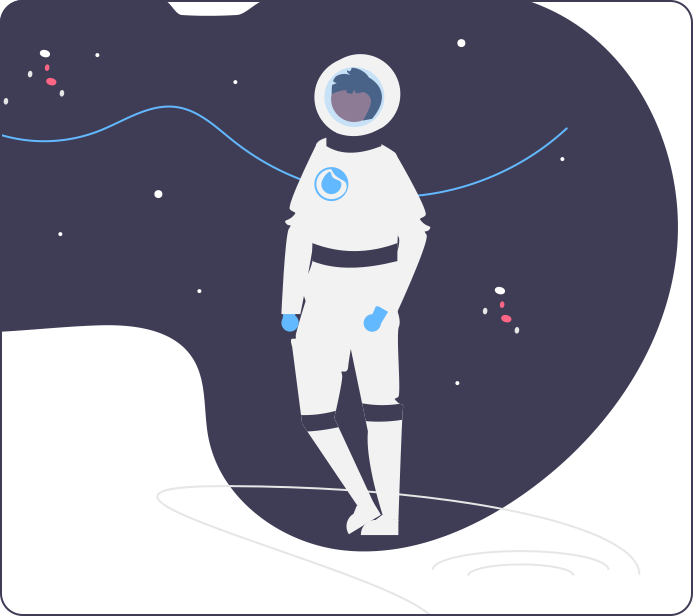

# Who am I? 👨🏻‍💻
 ```python
 class WhoAmI:
 	user = 'Pedro Alvarado'
		current_self = 'Full-Stack Developer'
		hobbies = [
				'Music Production',
				'Photography',
				'Hiking'
				'Videogames'
			]
	
	def getCity():
		return Barcelona_Spain()
	
	def SoftSkills():
		Teamwork()
		Creativity()
		Focus()
		
	
 ```
#### <p align="center">Currently I'm learning </p>
<p align="center"> 
 


</p>


#### <p align="center"> Let's create something awesome together! Send me a message! </p>

<p align="center">
     <a align="center" href="https://www.linkedin.com/in/pedroalvaradoh/">
         
     </a>
     <a href="mailto:pedroalvaradoh@gmail.com" target="_blank">
        
     </a>
 </p>
 <br>
 <br>
 
 <p align="center"> 
 
 
 
 </p>
 
 

